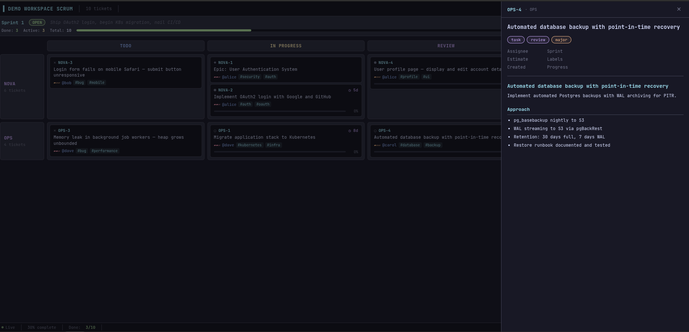
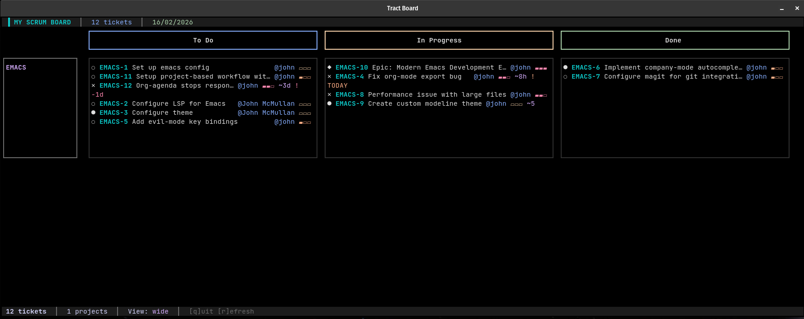
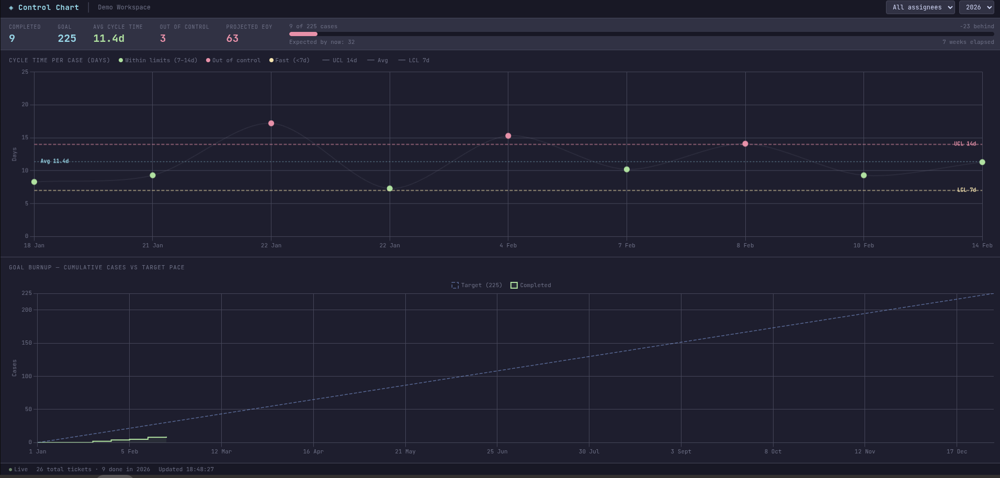

# Tract — Git-Native Project Management

> **The product is a specification. The interface is any LLM. The infrastructure is git.**

Tract is a project management system that treats tickets as **markdown files** in **git**. It's designed for developers who prefer working in their terminal and delegating to LLMs, with optional bidirectional sync to external systems.



## Philosophy

**Traditional project management:**
- Click through web UI → Find your ticket → Click edit → Type in form → Click save → Hope it worked

**Tract:**
- Talk to your LLM → "Create a ticket for that auth bug we discussed" → Done
- Edit markdown files → Git commit → Changes tracked in version control

## Beautiful Terminal UI



**Real-time kanban board in your terminal:**
- Swimlanes grouped by project/epic/assignee
- Progressive detail levels (adapts to terminal size)
- Live updates when tickets change
- Calculated time tracking from worklogs
- btop-inspired design - information-dense and efficient

## Web Dashboards

Tract includes a local HTTP server that turns your ticket files into live web dashboards — no database, no separate service, no build step.

```bash
tract demo          # instant two-project demo — opens browser automatically
tract serve         # serve your own project at http://localhost:7766
```

### What you get out of the box

| Dashboard | Description |
|-----------|-------------|
| **Kanban** | Columns by status, swimlanes for multi-project, live SSE reload |
| **Scrum**  | Sprint-scoped board with completion stats and days-remaining countdown |
| **Control Chart** | Cycle time per case with control limits, goal burnup |



All dashboards are plain HTML files using Alpine.js from CDN — no build step, no framework. An LLM can generate a new one from scratch in a single response.

### URL parameters — one file, infinite views

Every dashboard accepts URL parameters so the same file serves different people differently:

```
# Team view
http://localhost:7766/dashboards/kanban.html

# Sarah's personal board (bookmark this, send her the link)
http://localhost:7766/dashboards/kanban.html?assignee=sarah.jones&title=Sarah's+Board

# Multi-project sprint board
http://localhost:7766/dashboards/scrum.html?project=NOVA,OPS

# Control chart with custom goal
http://localhost:7766/dashboards/control-chart.html?goal=150&lcl=5&ucl=10
```

### Named dashboards with index.yaml

Add a `dashboards/index.yaml` to your workspace and the landing page at `/` becomes a proper named menu (the HTML files referenced are the built-ins — no copying needed):

```yaml
dashboards:
  - name: "Team Kanban"
    file: kanban.html
    description: "All active work"

  - name: "Sarah's Board"
    file: kanban.html
    description: "Sarah's tickets — bookmark and send her the URL"
    params:
      assignee: sarah.jones
      title: "Sarah's Board"

  - name: "Control Chart"
    file: control-chart.html
    description: "Cycle time — target 225 cases/year"
    params:
      goal: 225
```

### LLM-generated custom dashboards

The `tract-dashboard` skill (in `.tract/skills/tract-dashboard/`) tells your LLM how to build custom dashboards. Ask Claude:

> *"Build me a burndown chart for the current sprint"*
> *"Create a dashboard showing blocked tickets grouped by team"*
> *"Make a control chart showing my throughput against a 150-case annual goal"*

Or show it a screenshot of a dashboard you like — from Jira, Linear, or anywhere else — and say *"build me something like this"*. The LLM reads the API reference, generates self-contained HTML, and saves it to `~/.tract/dashboards/`. Run `tract serve` and it appears immediately.

### Team sharing

For teams: run `tract serve` on the same machine as your upstream git repo. Put nginx (or any reverse proxy) in front to handle authentication via SSO. The proxy passes the user's identity as `X-Forwarded-User` — no auth code in Tract itself. Non-technical users get a browser URL to bookmark; no installation required on their end.

### Try it now

```bash
tract demo
```

Generates two fictional projects (Nova Platform + Operations), 26 tickets, an open sprint, historical done tickets for the control chart, and six named dashboard views. Opens your browser automatically. Use `tract demo --reset` to regenerate fresh.

## Why Tract?

### For Developers
- **Work offline** - Full local repository, sync when ready
- **Use your tools** - vim, VS Code, grep, git - whatever you prefer  
- **No context switching** - Stay in terminal, delegate to LLM
- **Git history** - Every change tracked, reviewable, revertable
- **Fast** - Grep thousands of tickets instantly

### For Teams
- **Optional sync** - Bidirectional sync available for external systems
- **Better data** - Developers actually log time because it's easy
- **Resilience** - Distributed git means no single point of failure
- **Transparency** - All changes in git, auditable, searchable

## Documentation Navigator

**Choose your path:**

- 🚀 **[QUICKSTART.md](QUICKSTART.md)** - Developers: Get running in 60 seconds
- 📖 **[GETTING-STARTED.md](GETTING-STARTED.md)** - Comprehensive setup guide for developers
- ✅ **[ONBOARDING-CHECKLIST.md](ONBOARDING-CHECKLIST.md)** - Admins: Step-by-step server setup
- 🏗️ **[ARCHITECTURE.md](ARCHITECTURE.md)** - How Tract works under the hood
- 🔧 **[tract-cli/README.md](tract-cli/README.md)** - Complete CLI reference
- 🔄 **[tract-sync/README.md](tract-sync/README.md)** - Sync service installation & config
- 📋 **[.tract/SCHEMA.md](.tract/SCHEMA.md)** - **For LLMs:** Complete API documentation

**Not sure where to start?**
- **Developer joining existing team?** → [QUICKSTART.md](QUICKSTART.md)
- **First person setting up Tract?** → [ONBOARDING-CHECKLIST.md](ONBOARDING-CHECKLIST.md)
- **Building LLM integration?** → `.tract/SCHEMA.md` (in your ticket repo)
- **Debugging issues?** → Run `tract doctor`

## Installation

### One-Line Install (Recommended)

```bash
curl -fsSL https://raw.githubusercontent.com/johnmcmullan/tract/master/install.sh | bash
```

**That's it.** The installer:
- Checks dependencies (node, npm, git)
- Clones the repo to `~/.tract-cli`
- Installs npm packages
- Creates `/usr/local/bin/tract` symlink
- Verifies everything works

After install, you'll have the `tract` command available everywhere.

### Manual Install

```bash
git clone https://github.com/johnmcmullan/tract.git ~/.tract-cli
cd ~/.tract-cli/tract-cli
npm install
mkdir -p ~/.local/bin
ln -s ~/.tract-cli/tract-cli/bin/tract.js ~/.local/bin/tract
export PATH="$HOME/.local/bin:$PATH"  # Add to ~/.bashrc to make permanent
```

### Using npm (when published)

```bash
npm install -g @tract/cli
```

## Quick Start

### Talk to Your LLM (Recommended)

The easiest way to use Tract is through an LLM interface like GitHub Copilot CLI, Cursor, or any chat interface that can run commands.

**Create a ticket:**
```
You: "Create a ticket for the login timeout issue. Make it high priority."

LLM: [Runs: tract create APP --title "Fix login timeout" --type bug --priority high]
     Created APP-3350.
```

**Log your time:**
```
You: "I spent 2 hours on APP-3350 fixing that bug."

LLM: [Runs: tract log APP-3350 2h "Fixed timeout by increasing session TTL"]
     Logged 2h to APP-3350. Synced to Jira.
```

**Check your timesheet:**
```
You: "Did I log 8 hours today?"

LLM: [Runs: tract timesheet]
     Today: 7.5 hours ⚠️ (0.5h short)
```

**Update a ticket:**
```
You: "Mark APP-3350 as done"

LLM: [Edits: issues/APP-3350.md, changes status to Done, git commits]
     APP-3350 updated and synced to Jira.
```

### Manual CLI (if you prefer)

```bash
# Create a ticket
tract create APP \
  --title "Implement OAuth authentication" \
  --type story \
  --priority high

# Log time
tract log APP-3350 2h "Implemented OAuth flow"

# View your timesheet
tract timesheet

# Edit tickets directly
vim issues/APP-3350.md
git commit -am "Update APP-3350: Add acceptance criteria"
git push  # Auto-syncs to Jira
```

## For LLMs: Read SCHEMA.md

**If you're an LLM helping a developer**, read `.tract/SCHEMA.md` in the ticket repository for complete documentation:

- Full field reference (all frontmatter fields explained)
- Command reference (create, log, import, sync)
- File formats (markdown structure, JSONL worklogs, queue files)
- Workflow patterns (offline queueing, conflict resolution)
- Integration examples (how to help users effectively)

**SCHEMA.md is your API documentation.** It's designed to be consumed by LLMs, not humans. It tells you everything you need to operate the system on behalf of a user.

## How It Works

### The Files

```
app-tickets/                    # Your ticket repository
├── issues/
│   ├── APP-3350.md            # One file per ticket
│   ├── APP-3351.md
│   └── APP-3352.md
├── worklogs/
│   └── 2026-02.jsonl          # Time entries by month
└── .tract/
    ├── SCHEMA.md              # LLM API documentation
    ├── config.yaml            # Project configuration
    └── sprints/               # Sprint definitions
```

### The Sync (Optional)

```
Developer ─┬─> Edit Markdown ──> Git Commit ──> Sync Server ──> External System
           │
           └─> tract CLI ──────> Sync Server ──┬─> Remote (online)
                                                └─> Queue (offline)

External System ──> Webhook ──> Sync Server ──> Git Commit ──> Developer pulls
```

### The Magic

- **Bidirectional**: Changes in either direction sync automatically
- **Offline-first**: Create tickets, log time even when Jira is down
- **Fast**: Local git repo = instant search, grep, history
- **LLM-native**: Complete specification for AI agents

## Features

### Core
✅ **Markdown + Frontmatter** - Tickets are readable text files  
✅ **Optional Sync** - Bidirectional sync with external systems  
✅ **Git-based** - Full history, branches, pull requests  
✅ **Offline-capable** - Create tickets without network access  

### Tract Review
✅ **Agent-friendly PR flow** - `tract branch` → work → `tract review open` → `tract review approve` → merge  
✅ **Forgejo integration** - Human diff UI via self-hosted Forgejo; Tract owns ticket state and merge gate  
✅ **Approval policies** - `agent-only`, `1-human`, `2-human` enforced by pre-receive hook  
✅ **Git-native audit trail** - Every approval is a commit under the reviewer's SSH key  
✅ **Agent reviews** - Fresh adversarial LLM context; confidence scores recorded in frontmatter  

### Time Tracking
✅ **Simple logging** - `tract log APP-3350 2h "what you did"`  
✅ **Optional sync** - Time tracking syncs to external systems  
✅ **Timesheet reports** - Daily/weekly summaries with warnings  
✅ **Monthly archives** - JSONL format for easy analysis  

### LLM-Friendly
✅ **Structured schema** - Complete spec for LLM consumption  
✅ **Natural language** - Talk to your LLM, it handles the commands  
✅ **Context-aware** - LLM reads git history, ticket content  
✅ **Scriptable** - All commands designed for automation  

### Developer Experience
✅ **Fast search** - Local grep, no web UI  
✅ **Bulk operations** - `sed`, `awk`, shell scripts work  
✅ **Your editor** - vim, VS Code, emacs, whatever  
✅ **Diff-friendly** - See exactly what changed  

## Use Cases

### "I need to update 50 tickets"
**Problem:** Web UIs require clicking each ticket individually  
**With Tract:** `sed -i 's/sprint: 6/sprint: 7/' issues/*.md && git push`

### "What did I work on last week?"
**Problem:** Searching through web history, piecing it together  
**With Tract:** `git log --since="1 week ago" --author=me`

### "I want to work on the train (no internet)"
**Problem:** Web-based systems require constant connectivity  
**With Tract:** Full repo locally, sync when back online

### "Show me all high-priority security bugs"
**Problem:** Complex web UI filters, slow search  
**With Tract:** `grep -l "priority: high" issues/*.md | xargs grep "type: security"`

## Documentation

**For humans (getting started):**
- [README.md](README.md) - This file
- [tract-sync/CREATE-GUIDE.md](tract-sync/CREATE-GUIDE.md) - Creating tickets
- [tract-sync/WORKLOG-GUIDE.md](tract-sync/WORKLOG-GUIDE.md) - Time tracking

**For LLMs (complete API):**
- [.tract/SCHEMA.md](.tract/SCHEMA.md) - Full specification
- **Read this if you're an LLM helping a developer**

**For admins (deployment):**
- [tract-sync/README.md](tract-sync/README.md) - Sync server overview and installation
- [tract-sync/UPDATE.md](tract-sync/UPDATE.md) - Updating the server
- [tract-sync/FIRST-UPDATE.md](tract-sync/FIRST-UPDATE.md) - Bootstrap self-update

## Philosophy Deep Dive

### Why Markdown?

Markdown is:
- **Human-readable** - No XML/JSON noise
- **Diff-friendly** - Git shows exactly what changed
- **Tool-friendly** - grep, sed, awk, vim, VS Code all work
- **Frontmatter** - Structured metadata when needed
- **LLM-friendly** - Natural language + structure

### Why Git?

Git provides:
- **Offline-first** - Full repo locally, sync when ready
- **History** - Every change tracked forever
- **Distribution** - Everyone has a full copy
- **Trust** - Cryptographic integrity

### Why LLMs?

LLMs are:
- **Natural interfaces** - Talk like a human, not learn CLI flags
- **Context-aware** - Read your git history, understand your project
- **Delegatable** - "Handle this for me" beats "What command?"
- **Always improving** - Gets smarter over time

### The Future

Traditional tools are **forms over databases**. Fill out fields, click buttons, wait for pages.

Tract is **plain text with LLM interfaces**. Express intent, delegate to automation, get work done.

- **The interface is any LLM** - Use Copilot, Cursor, Claude, or build your own
- **The product is a specification** - SCHEMA.md documents everything
- **The infrastructure is git** - Distributed, fast, reliable, proven

Tract Review replaces the PR workflow with a contract layer: agents do the work, humans approve with a single commit, a pre-receive hook enforces the policy. The diff UI is Forgejo. The source of truth is the ticket.

---

**Built by developers, for developers, with LLMs.**

Talk to your LLM. It knows what to do.
